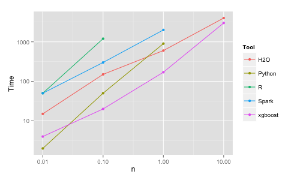

### Simple/limited/incomplete benchmark for scalability/speed and accuracy of machine learning libraries for classification

This project aims at a *minimal* benchmark for scalability, speed and accuracy of commonly used implementations
of a few machine learning algorithms. The target of this study is binary classification with numeric and categorical inputs (of 
limited cardinality i.e. not very sparse) and no missing data. If the input matrix is of *n* x *p*, *n* is 
varied as 10K, 100K, 1M, 10M, while *p* is about 1K (after expanding the categoricals into dummy 
variables/one-hot encoding).

The algorithms studied are 
- linear (logistic regression, linear SVM)
- random forest
- boosting 
- deep neural network

in various commonly used open source implementations like 
- R packages
- Python scikit-learn
- Vowpal Wabbit
- H2O 
- Spark MLlib.

Random forest, boosting and more recently deep neural networks are the algos expected to perform the best on the structure/sizes
described above (e.g. vs alternatives such as *k*-nearest neighbors, naive-Bayes, decision trees etc). 
Non-linear SVMs are also among the best in accuracy in general, but become slow/cannot scale for the larger *n*
sizes we want to deal with. The linear models are less accurate in general and are used here only 
as a baseline (but they can scale better and some of them can deal with very sparse features). 

Scalability here means the algos are able to complete (in decent time) for the given *n* sizes. 
The main contraint is RAM (a given algo/implementation can crash if running out of memory), but some 
of the algos/implementations can work in a distributed setting. Speed is determined by computational
complexity but also if the algo/implementation can use multiple processor cores.
Accuracy is measured by AUC. The interpretability of models is not of concern in this project.

In summary, we are focusing on which algos/implementations can be used to train relatively accurate binary classifiers for data
with millions of observations and thousands of features processed on commodity hardware (mainly one machine with decent RAM and several cores).

#### Data

Training datasets of sizes 10K, 100K, 1M, 10M are [generated](0-init/2-gendata.txt) from the well-known airline dataset (using years 2005 and 2006). 
A test set of size 100K is generated from the same (using year 2007). The task is to predict whether a flight will
be delayed by more than 15 minutes. While we study primarily the scalability of algos/implementations, it is also interesting
to see how much more information and consequently accuracy the same model can obtain with more data (more observations).

#### Setup 

The tests have been carried out on a Amazon EC2 c3.8xlarge instance (32 cores, 60GB RAM). The tools are freely available and 
their [installation](0-init/1-install.txt) is trivial.

As a first step, the models have been trained with default parameters. As a next step we should do search in the hyper-parameter
space with cross validation (that will require more work and way more running time).

#### Results

For each algo/tool and each size *n* we observe the following: training time, maximum memory usage during training (vs
size of data and model in RAM), CPU usage on the cores, 
and AUC as a measure for predictive accuracy. 
Times to read the data, pre-process the data, score the test data are also observed but not
reported (not the bottleneck).

##### Linear Models

...

##### Random Forest

Random forests with 500 trees have been trained in each tool choosing the default of square root of *p* as the number of
variables to split on.

Tool    | *n*  |   Time (sec)  | RAM (GB) | AUC
-------------------------|------|---------------|----------|--------
R       | 10K  |      50       |   10     | 68.2
        | 100K |     1200      |   35     | 71.2
        | 1M   |     crash     |          |
Python  | 10K  |      2        |   2      | 68.4
        | 100K |     50        |   5      | 71.4
        | 1M   |     900       |   20     | 73.2
        | 10M  |  pre-crash    |          |
H2O     | 10K  |      5        |   2      | 68.7
        | 100K |      30       |   10     | 70.2
        | 1M   |      100      |   25     | 71.8
        | 10M  |      600      |   30     | 73.2
Spark   | 10K  |      150      |   10     | 65.5
        | 100K |      1000     |   30     | 67.9
        | 1M   |     crash     |          |

The [R](2-rf/1.R) implementation is slow and inefficient in memory use (100x the size of the 
dataset). It cannot cope by default with a large number of categories, therefore the data had
to be one-hot encoded. The implementation uses 1 processor core, but with 2 lines of extra code
it is easy to build
the trees in parallel using all the cores and combine them at the end.

The [Python](2-rf/2.py) implementation is fast, more memory efficient and uses all the cores.
Variables needed to be one-hot encoded (which is more involved than for R) 
and for *n* = 10M doing this exhausted all the memory.

The [H2O](2-rf/4-h2o.R) implementation is fast, memory efficient and uses all cores. It deals
with categorical variables automatically. The accuracy on *n* = 100K and 1M is lower than for the
Python version.

[Spark](2-rf/5b-spark.txt) implementation is slow, provides the lowest accuracy and disappointingly
(for a "big data" system) it [crashes](2-rf/5c-spark-crash.txt) already at *n* = 1M. 
Also, reading the data is more than one line of code and Spark does not provide a one-hot encoder
for the categorical data (therefore I used R for that).
Finally, the reason for the very poor predictive accuracy is that Spark's decision trees are 
limited to maximal depth of 30 and random forests 
[need](https://www.stat.berkeley.edu/~breiman/RandomForests/cc_home.htm) 
trees grown to the "largest extent possible". On the other hand, if Spark grew larger trees, that would
make the training even slower.

##### Boosting

...
    

